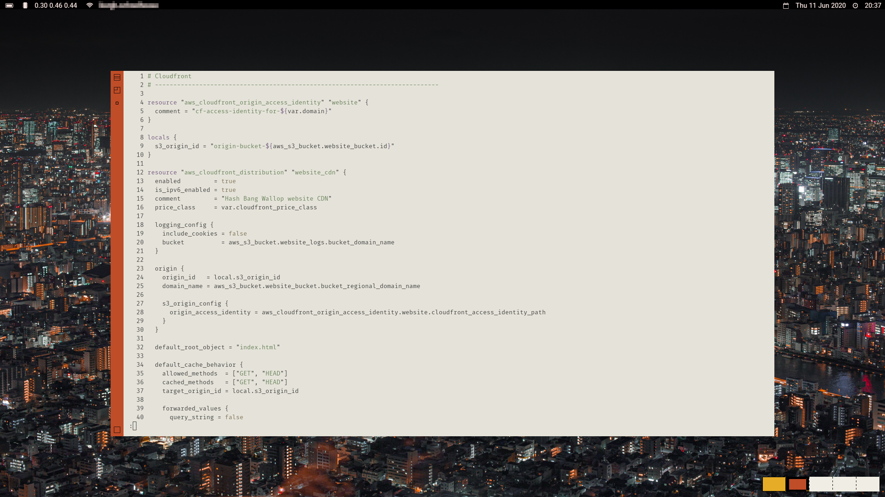
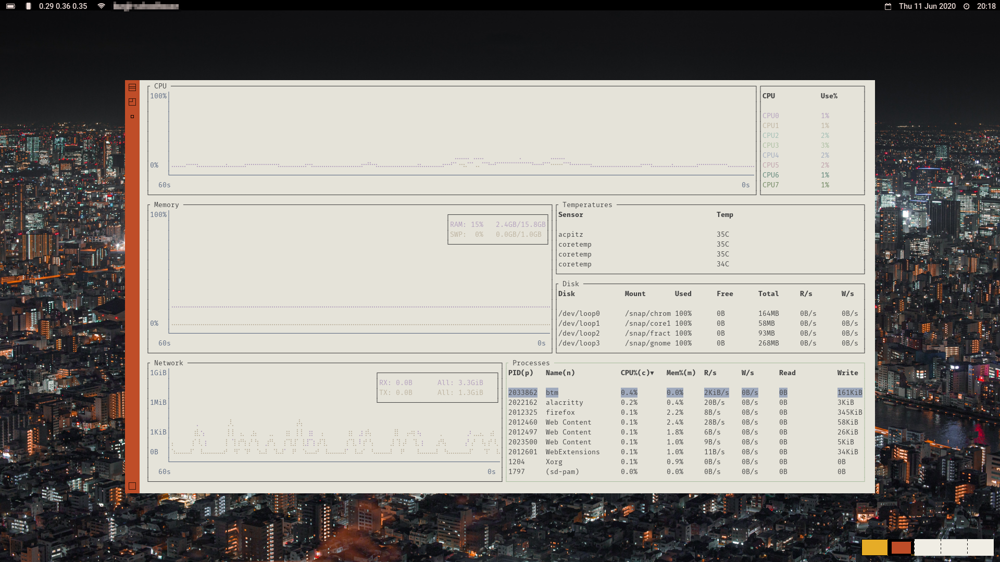
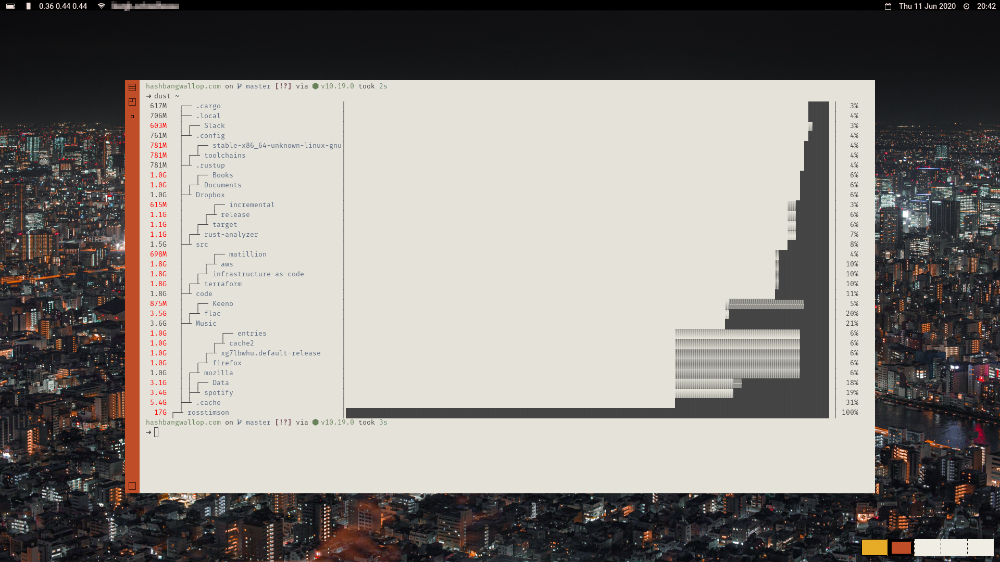
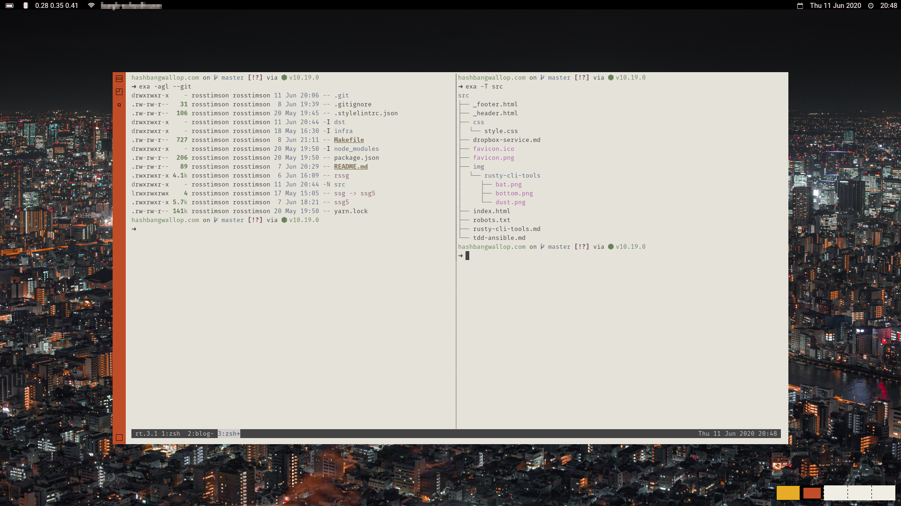
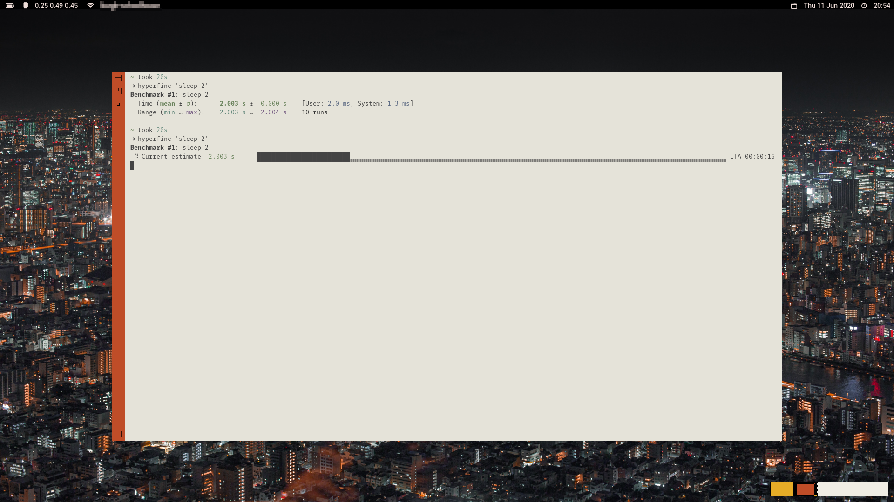
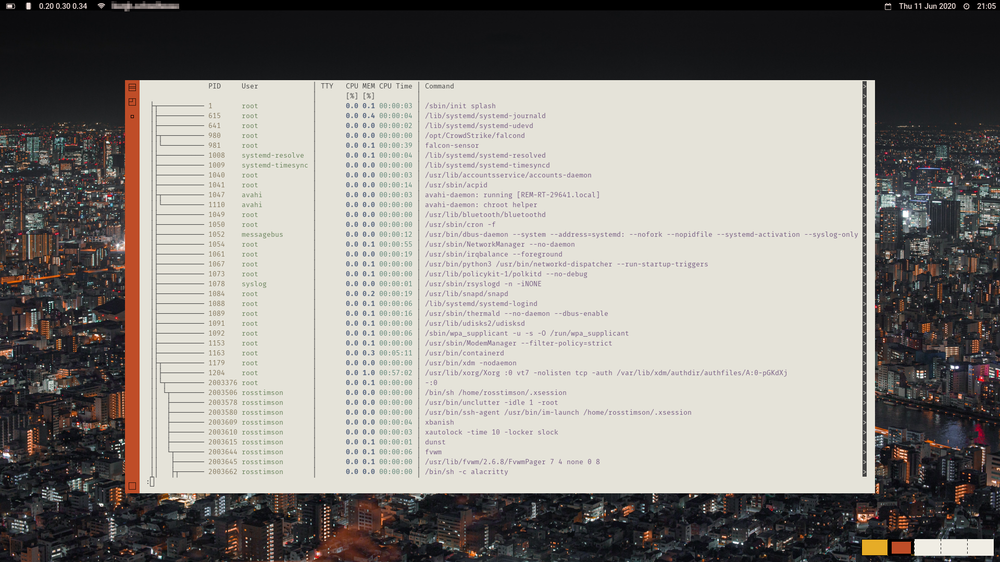
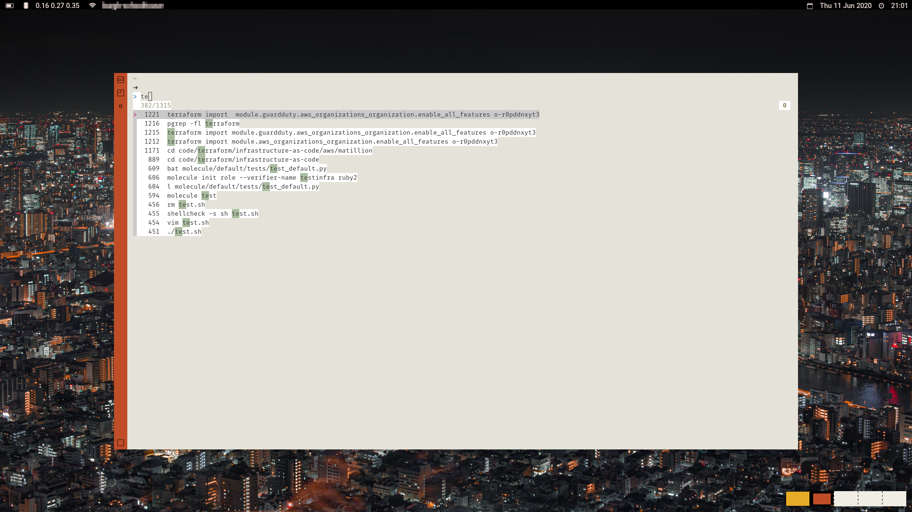
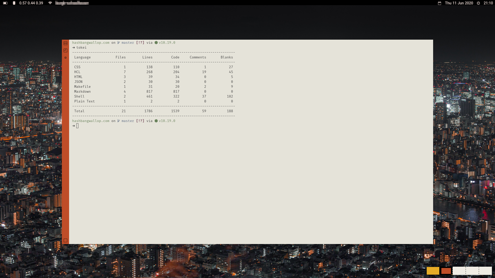

# Rusty Command Line Tools

## Introduction

Rust is quickly cementing itself as the language of choice for writing
system tools largely due to its speed and memory-safety.  There is now
a large amount of 'new breed' CLI tools that are written in Rust that
are awesome, these are the tools that I use, many of them have
completely replaced their standard system counterparts, for example on
my local machine I **never* use `grep` anymore and prefer Ripgrep
instead.

You can see my config for many of these tools in my [dotfiles on
Github](https://github.com/rosstimson/dotfiles).

## [Alacritty](https://github.com/alacritty/alacritty)

Alacritty is now my terminal emulator of choice after lengthy stints
with `st` and before that `rxvt-unicode`.  Alacritty is fast, largely
due to it using the GPU for rendering, on their Github page they
reference a benchmarking tool
[vtebench](https://github.com/alacritty/vtebench) which I gave a try
myself just out of interest, these are my results from `hyperfine
--show-output "cat target/benchmarks/scrolling.vte"`:

### Alacritty

    Time (mean ± σ):      1.699 s ±  0.026 s    [User: 0.1 ms, System: 1698.9 ms]
    Range (min … max):    1.665 s …  1.747 s    10 runs

### Xterm

    Time (mean ± σ):     159.961 s ±  1.693 s    [User: 1.1 ms, System: 5882.7 ms]
    Range (min … max):   155.219 s … 160.984 s    10 runs

### Urxvtc

    Time (mean ± σ):      1.709 s ±  0.027 s    [User: 0.5 ms, System: 1709.5 ms]
    Range (min … max):    1.689 s …  1.768 s    10 runs

### St

    Time (mean ± σ):      4.134 s ±  0.471 s    [User: 0.0 ms, System: 4085.8 ms]
    Range (min … max):    3.717 s …  4.863 s    10 runs

Surprising to see rxvt-unicode competing so well there.

Configuration of Alacritty is done via a simple YAML file, one of the weird issues I had was with the font rendering huge no matter what size I had set it to, if you encounter this then the fix for me was setting:

    env:
        WINIT_X11_SCALE_FACTOR: '1'

## [Bat](https://github.com/sharkdp/bat)

`bat` is a replacement for `cat` that has support for syntax
highlighting and has Git integration too.  I often use `cat` to
quickly output a file so I can cut 'n' paste the contents to somewhere
like work's Slack, by default `bat` was outputting some extra fancy
bits such as line numbers and a table-like UI, I turned these off and
set a colour theme that better suited my terminal's colours with:

    # ~/.config/bat/config

    --theme="ansi-light"
    --style="changes"

Lastly, if `bat` doesn't already support syntax highlighting for the
type of file you are looking at it can easily be added, I added
Terraform highlighting which is what you can see in the screenshot.

[][bat]

## [Bottom](https://github.com/ClementTsang/bottom)

Bottom, or `btm` which is the actual command, is a fancy alternative
to `top` or `htop`.  You can customise most elements of the output
with a TOML file, I had to change a bunch of colours as some elements
weren't very visible with my terminal colours.

[][bottom]

## [Dust](https://github.com/bootandy/dust)

`dust` is a more intuitive alternative to `du`, it also shows a fancy
graph so you can easily spot what is gobbling up all your disk space.

[][dust]

## [Exa](https://the.exa.website/)

Exa is an alternative to `ls` which I'm now using via aliases `alias
l='exa -agl --git'` and `alias ls='exa'`.  Exa has colours for
filetypes and pretty much everything else, in fact it has so many
colours I had to turn some off as separate colours for each permission
bit is a tad too much, you can do that with:

    export EXA_COLORS="uu=0:gu=0:ur=0:uw=0:ux=0:ue=0:gr=0:gw=0:gx=0:tr=0:tw=0:tx=0"

Exa also has support for git and will show in the listing if items
have been modified, are ignored, or are new to the Git repo.  Lastly,
Exa also has the `-T` flag which is essentially a more powerful
replacement for `tree`.

[][exa]

## [Fd](https://github.com/sharkdp/fd)

`fd` is a user-friendly alternative to `find`, no having to remember
that you put the directory to search in before the search term, no
remembering the weird `-name ...` or `-type d` flags.  `fd` is also
very fast even when searching over the entire filesystem.

## [Hyperfine](https://github.com/sharkdp/hyperfine)

`hyperfine` is a bit like `time` but it shows you some fancy progress
bar, it also runs the thing you are timing multiple times, 10 times by
default, it then gives you the average and the min/max range.
`hyperfine` is what I used to time the terminal benchmarks I have in
the Alacritty section.

[][hyperfine]

## [Ion](https://gitlab.redox-os.org/redox-os/ion)

Ion is not really a tool but it is getting an honourable mention as it
is a new shell written in Rust, it is part of the [Redox
OS](https://www.redox-os.org) which is a full Unix-like operating
system completely written in Rust.  Ion does not aim to be POSIX
compliant but has some interesting ideas such as type checking
function arguments, and arrays and hashmaps that are much more similar
to what you're used to with programming languages.

Ion is still considered an 'alpha' release, I did switch to it as my
default shell but I had a few niggles with it and eventually moved
back to `zsh`.  A bunch of my issues stemmed from integrating with
other helper scripts that probably weren't working properly due to
the lack of POSIX compliance, a minor issues was having to keep
remembering to use quotes when doing a command that had `@` in it such
as ssh or git repo cloning, the `@` sigil is used for arrays in Ion so
without quotes it would get confused.  Lastly, and my biggest issue
with Ion was the lack of autocompletion, it has some basic completion
but even then it shows things like env vars when you're trying to `cd`
into a directory; I couldn't see any way to add custom completion
currently, I'm sure that is on the roadmap.

## [Licensor](https://github.com/raftario/licensor)

Stop looking up open source licenses for your projects and then cut
'n' pasting, `licensor` quickly outputs a variety of OSS licenses to
`stdout`.

## [Procs](https://github.com/dalance/procs)

`procs` is a replacement for `ps`, it has support for some stuff that
`ps` doesn't such as TCP/UDP ports and Docker container names, the
output is a bit nicer and there is also a watch mode and tree view.

[][procs]

## [Rage](https://github.com/str4d/rage)

`rage` is the Rust implementation of [age](https://age-encryption.org)
which is a simple, modern and secure encryption tool with small
explicit keys, no config options, and UNIX-style composability.  It
aims to be a modern and simpler replacement for tools such as `gnupg`.

## [Ripgrep](https://github.com/BurntSushi/ripgrep)

Ripgrep, or `rg` which is its command is a replacement for `grep` and
recursive search tools like Ack and The Silver Searcher, it is very
fast and is one of the first things I install on a new machine these
days.  Ripgrep can be integrated into most text editors.

## [Sd](https://github.com/chmln/sd)

I've not had a need to try `sd` yet but it looks like a much more
intuitive alternative to `sed` and will definitely will become my go
to tool when ordinarily I would have reached for `sed`.  It also looks
to be a lot quicker than `sed` if the benchmarks on their readme are
accurate.

## [Skim](https://github.com/lotabout/skim)

Skim, or `sk` is a fuzzy finder which is similar to
[fzf](https://github.com/junegunn/fzf).  Skim has keybindings for your
shell that are unashamedly pinched from fzf such as `ctrl-r` for
reverse searching command history which is what is shown in the
screenshot.  Skim can also be integrated with your text editor such as
Vim.  You can customise the colours and output via setting default
options in an env var, I've tweaked the colours a little bit and it so
that the interface shows below the command rather than above:

    export SKIM_DEFAULT_OPTIONS='--layout=reverse --color=light,fg:8,bg:15,current_bg:7,matched_bg:10,current_match:8'

[][skim]

## [Starship](https://starship.rs/)

Starship is a prompt for your shell, it is cross platform and seems to
be very fast.  I have used other tools in the past mainly for showing
git status in my shell, you can definitely feel a slight slow down
with those, I don't notice it at all with Starship.  You can customise
the prompt with a fairly intuitive TOML file.  Starship does much more
than just git status though, it has modules for all sorts.  By default
it uses emojis for things which I find a bit over the top so I've
switched to using simpler icons via [Nerd
fonts](https://www.nerdfonts.com), the prompt you can see in all of
the screenshots is Starship using the Fira Mono Nerd font, you can see
the rest of my Starship config in my [dotfiles on
Github](https://github.com/rosstimson/dotfiles/blob/master/.config/starship.toml).

## [Tokei](https://github.com/XAMPPRocky/tokei)

`tokei` is a very simple tool that shows various stats about the code
in your project.

[][tokei]

## [Zoxide](https://github.com/ajeetdsouza/zoxide)

Zoxide gives you a `z` command that allows you to quickly jump to
frequently used directories.  It is similar to
[z](https://github.com/rupa/z) which is written in shell, it will
build up a history of your most frequently used directories and will
then fuzzy match them when you try to jump to them.  For example I
work on Terraform code for work a lot that lives in
`~/code/terraform/infrastructure-as-code`, no matter what directory
I'm currently in I can quickly jump to there with `z infra`.  Zoxide
also has a fancy fuzzy search integration with fzf, I'd really like
the option to use Skim instead but the project maintainer currently
does not want to switch to Skim as the default despite it also being
in Rust as Skim currently does not work with Windows, some way to
choose between the two would be the best of both worlds.

[bat]: img/rusty-cli-tools/bat.png
[bottom]: img/rusty-cli-tools/bottom.png
[dust]: img/rusty-cli-tools/dust.png
[exa]: img/rusty-cli-tools/exa.png
[hyperfine]: img/rusty-cli-tools/hyperfine.png
[procs]: img/rusty-cli-tools/procs.png
[skim]: img/rusty-cli-tools/skim.png
[tokei]: img/rusty-cli-tools/tokei.png
